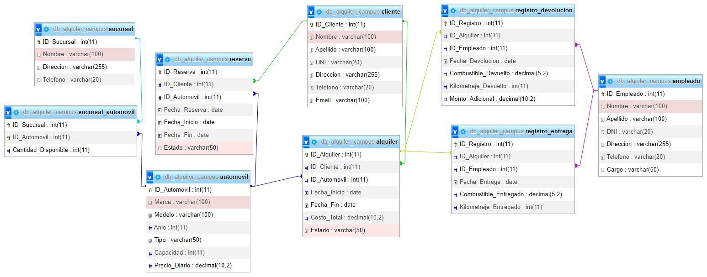

## Mongo DB  

Cuando hablamos de bases de datos tendemos a pensar en SQL y el modelo de bases de datos relacional, pero existen alternativas como los modelos no relacionales donde MongoDB es quizá el ejemplo más destacado.

MongoDB (del inglés humongous, "enorme") es un sistema de base de datos NoSQL orientado a documentos de código abierto y escrito en C++, que en lugar de guardar los datos en tablas lo hace en estructuras de datos BSON (similar a JSON) con un esquema dinámico. Al ser un proyecto de código abierto, sus binarios están disponibles para los sistemas operativos Windows, GNU/Linux, OS X y Solaris y es usado en múltiples proyectos o implementaciones en empresas como MTV Network, Craigslist, BCI o Foursquare.

## Inicialización del proyecto. 

- Clonamos el proyecto en un directorio. 
- Entramos al directorio clonado

```bash
> git clone https://github.com/TheHackBoxCampus/mongoAlquiler.git
> cd mongodbAlquiler 
```

## Crea el archivo de enviroments: 

- En la raiz del proyecto, crea un archivo ``.env``

- Configura las propiedades: Servidor de express, datos de mongodb atlas, key de token 

```text
SERVER={"...": "localhost", "port": ...}
USER_DB={"username": "...", "password": "...", "database": "..."}
KEY="..."
```

## Cluster de Mongo DB atlas

Para que podamos ejecutar el script ``'query.mongodb'`` tenemos que conectarnos con ``mongo``, existen varias formas de utilizar mongo
te puedes conectar al loopback o directamente al cloud con mongo db ``ATLAS``

En esta ocasión se estara utilizando ``mongodb atlas`` para registrar los documentos en la nube.

Requerimientos:

- Tener una cuenta de mongoDB ``atlas`` 
- ! si no tienes una cuenta puedes consultar este video y realizar el proceso: https://youtu.be/hXyIv_vKdUs
- Tener autenticacion para conectarse con ``atlas``, es decir consultar un enlace como el siguiente: 

```txt
> mongodb+srv://<user>:<password>@<cluster>/

// user => escriba su usuario
// password => escriba su contraseña
// cluster => consultelo en mongo atlas en su database. Es propio NO generico
``` 
- Una vez ya consultado puede conectarte con ``mongoDB compass`` o con la extension de **visual studio code** -> ``mongoDB`` 
 
### Mongo DB Compass


### Mongo DB Extension de VSCODE 


- Cualquiera de las 2 opciones son validas, depende de gusto y comodidad


## Modifica el cluster en el proyecto
- Una vez que tengas el cluster 
- Dirigite a la ruta ``src/config/db.js``
- Cambia el cluster:

#### Nota: La propiedad ``globalProperties`` viene del archivo ``src/env/env.js``
```js
let credentials = JSON.parse(globalProperties.USERDB); 
let uri = "mongodb+srv://${credentials.username}:${credentials.password}@<cluster>${credentials.database}" 
// Puedes cambiar el nombre de la variable o dejarlo asi.
// cambia el cluster por el que tienes en mongodb atlas
```

## Conexion a mongo db con el client 

- Te puedes conectar de esta forma:

```js
import { MongoClient } from "mongodb";
import globalProperties from "../env/env.js";

const conx = async () => {
    try {
        let credentials = JSON.parse(globalProperties.USERDB);
        let uri = "mongodb+srv://${credentials.username}:${credentials.password}@<cluster>${credentials.database}";
        let options = {
            useNewUrlParser: true,
            useunifiedtopology: true
        }
        let client = await MongoClient.connect(uri, options);
        console.log("db --> success");
        return client.db(); 
    }catch(err) {
        console.error(err.message)
    }
}

export default conx; 
```

## Transpila los archivos .*ts (typescript)

- En el archivo package.json
- Encontraras en los scripts. El siguiente comando: 

```json
"scripts": {
    "tsc": "tsc -w" 
}
```

- Para ejecutarlo y transpilar los archivos ejecuta el comando en la terminal, de la siguiente manera:

```bash
npm run tsc
```

- Esto transpilara los archivos ts a javascript en la ruta ``src/storage/structure``


#### Para que esto funcionara:

Por default en el proyecto, vendra un archivo ``tsconfig.json``, donde estaran las configuraciones del compilador para cambiar los *.ts a *.js 

- No toques esta parte
- Puedes consultar mas en las paginas oficiales

```json
{
    "compilerOptions": {
        "target": "ES6",
        "module": "ES6",
        "moduleResolution": "node",
        "outDir": "src/storage/structure",
        "esModuleInterop": true,        
        "experimentalDecorators": true,
        "emitDecoratorMetadata": true
    },
    "include": [
        "src/storage/structure/*.ts"
    ],

    "exclude": [
        "src/storage/structure/*.js"
    ]
}
```

## Poner en escucha el servidor de express:

- En el archivo package.json
- Encontraras en los scripts. El siguiente comando: 

```json
"scripts": {
    "dev": "nodemon --quiet src/index.js"
}
```

- Para ejecutarlo y poner en escucha al servidor: escribe en la terminal

```bash
npm run dev
```

## ¿Como se configuro el servidor?

- ** EJEMPLO DE USO ** 
- Este ejemplo no tiene uso en el proyecto, es instructivo para el entendimiento del express.

Para que los endpoints tengan funcionamiento con el `` Router ``  de express, primero tenemos que desplegar un servidor 
```js
import express from 'express';
let app = express();

let config = {
    hostname : "IP",
    port: "port"
};

app.listen(config, () => {
    console.log(`server lanzado en http://${config.hostname}:${config.port}`);
})
```
Configuramos los middleware para que acepte valores json y de texto
```javascript
import express from 'express';
let app = express(); 
// middleware
app.use(express.text())
app.use(express.json())
```
Con el ``Router`` de express en nuestro archivo app.js definimos la ruta principal llamada dbCampus
```javascript
// importamos las rutas de nuestro archivo routes, /* mas informacion mas adelante */
import express from 'express';
import router from './router/routes.js'
let app = express(); 

app.use("consultas", router); 
```

## Enrutado con Router / Express 
### Consultas HTTP en Router / Express

- ** EJEMPLO DE USO ** 
- Este ejemplo no tiene uso en el proyecto, es instructivo para el entendimiento del router y la conexion de mongodb con el client.

- Importar el MODULO ``Router`` de express
- importar la conexión exportada de mongo db

```javascript
import { Router } from "express";
import { conx } from "../config/db.js";

let router = Router(); 

// diferentes metodos get, post, put, delete
router.get("/", async (req, res) => {
    let db = await conx();
    let bodegas = await db.collection("bodegas");
    let consulta = await bodegas.find().toArray(); 
    res.send(consulta)
} )
```

### Dependencias del proyecto 

En esta seccion te voy a explicar con que funciona el proyecto, Ejemplos genericos para que entiendas el funcionamiento.

### DTO 
Tus datos necesitan seguridad, ¿Cómo se puede garantizar una seguridad?, Precisamente con los Data Transfer Object (Transferencia de los datos), El dto es una capa de abstraccion que nos permite transformar y manipular los datos de la forma que queramos, por ende dando validaciones y permisos, lo que hace que tus datos lleguen de manera mas segura al backend de tu aplicacion.

Para la utilizacion de los dto: 
-  Se utilza javascript tipado, teniendo en cuenta de que typescript se compila a javascript y el funcionamiento de los tipados es unicamente en el proceso de compilación no de ``Ejecucion`` 
- Por lo mismo se utilizan las librerias, para informar los errores cuando se detecten en la compilacion

### Ejemplo de un dto con los decoradores
```ts
// libraries 
import { Transform, Expose } from "class-transformer";

class CLASS {
  @Expose({ name: "prop" })
  @Transform(({ value }) => {
     // * validations
  })
  prop: number;
  constructor(prop: number) {
    this.prop = prop;
  }
}

export default CLASS;
```

## JWT (Json Web Tokens)
Los datos estan un poco mas sanitizados pero ¿Cómo puedo autorizar al usuario o dar permisos al usuario?, El algoritmo HS256 del tipo JWT permite crear tokens, que son los tokens, El token es una referencia (un identificador) que regresa a los datos sensibles a través de un sistema de tokenización.

### ¿Que funcionamiento tienen los tokens?
En el mismo se define un mecanismo para poder propagar entre dos partes, y de forma segura, la identidad de un determinado usuario, además con una serie de claims o privilegios.

Estos privilegios están codificados en objetos de tipo JSON, que se incrustan dentro de del payload o cuerpo de un mensaje que va firmado digitalmente.

### Ejemplo de token


### Estructura de un token 


* Header: encabezado dónde se indica, al menos, el algoritmo y el tipo de token, que en el caso del ejemplo anterior era el algoritmo HS256 y un token JWT.

* Payload: donde aparecen los datos de usuario y privilegios, así como toda la información que queramos añadir, todos los datos que creamos convenientes.

* Signature: una firma que nos permite verificar si el token es válido, y aquí es donde radica el quid de la cuestión, ya que si estamos tratando de hacer una comunicación segura entre partes y hemos visto que podemos coger cualquier token y ver su contenido con una herramienta sencilla, ¿dónde reside entonces la potencia de todo esto?


### Ejemplo en codigo 
Para la utilización del token JWT, se puede implementar con la libreria jsonwebtokens, pero en este caso aprovechando los modulos de la libreria ``jose``
```js
import jwt from "jsonwebtoken";
```
Verificar el token:
```js
// jwtverify
 jwt.verify(token, globalProperties.KEY, { algorithms: "HS256" }, (err, decoded) => {
        err ? cb(err) : cb(null, decoded, { scope: "*" })
})
```
Crear el token:
```js
// Sign
 let token = new Promise((resolve, reject) => {
    jwt.sign(payload, globalProperties.KEY, {algorithm: "HS256", expiresIn: "10m"}, (err, token) => {
         err ? reject(err) : resolve(token) 
    })
})
```

## Passport-http-Bearer

Informacion Oficial:

**"El módulo Passport-http-bearer proporciona una estrategia Passport para autenticar tokens de portador utilizados de acuerdo con el esquema de autenticación de HTTP Bearer.**

**Los tokens de portador son una credencial que puede utilizar cualquier parte en posesión del token para obtener acceso a un recurso protegido. El uso de un token de portador no requiere ninguna credencial adicional, como una clave criptográfica. Como tales, los tokens al portador deben protegerse contra la divulgación tanto en el almacenamiento como en el transporte para poder utilizarlos de forma segura.**

**El esquema de autenticación de Bearer está especificado por RFC 6750. Este esquema fue diseñado para usarse con tokens de acceso emitidos usando OAuth 2.0. Sin embargo, este esquema se puede utilizar dentro del marco general de autenticación HTTP (RFC 7235) y también se puede utilizar para autenticar tokens de portador emitidos a través de otros mecanismos".**


### Ejemplo de uso

- importa la estrategia 
```js
import {Strategy as BearerStrategy} from "passport-http-bearer"
```

- Ejemplo generico para la configuración de la libreria.
 
```js
new BearerStrategy(function(token, cb) {
  tokens.findOne({ value: token }, function(err, claims) {
    if (err) { return cb(err); }
    if (!claims) { return cb(null, false); }

    users.findOne({ id: claims.userID }, function (err, user) {
      if (err) { return cb(err); }
      if (!user) { return cb(null, false); }
      return cb(null, user, { scope: claims.scope });
    });
  });
});
```

## Morgan 

Informacion Oficial: 

**"Morgan: Morgan es un Middleware de nivel de solicitud HTTP. Es una gran herramienta que registra las solicitudes junto con otra información dependiendo de su configuración y el ajuste preestablecido utilizado. Resulta muy útil durante la depuración y también si lo desea. para crear archivos de registro."**

### Ejemplo de uso:

Importa el paquete de morgan 


```js
import morgan from "morgan" // es6
```

- En el archivo app.js en los middleware agrega esta linea de codigo:

```js
app.use(morgan("dev")) // mode dev => detect HTTP requests
```

- Te permitira ver el estado de las peticiones que se hacen al servidor, cuantas se han hecho y a que ruta. 

## Express-rate-limit 

Informacion Oficial: 

**La limitación de velocidad es una estrategia que puede utilizar para controlar el tráfico en una red. Limita la cantidad de solicitudes que un usuario puede realizar dentro de un período de tiempo específico.**

Ejemplo de uso: 

- Configuracion 

```js
import rateLimit from 'express-rate-limit'

const limiter = rateLimit({
	windowMs: 15 * 60 * 1000, // 15 minutes
	max: 100, // Limit each IP to 100 requests per `window` (here, per 15 minutes)
	standardHeaders: true, // Return rate limit info in the `RateLimit-*` headers
	legacyHeaders: false, // Disable the `X-RateLimit-*` headers
	// store: ... , // Use an external store for more precise rate limiting
})
```

- Utiliza la funcion limiter en las rutas 
- Pasalo como middleware

```js
router.get("/", limiter(), (req, res) => res.send("hello world!"))
```

## CORS

Informacion oficial: 

**El mecanismo CORS soporta peticiones seguras de origen cruzado y trasferencias de datos entre navegadores y servidores**

Ejemplo de uso: 

En general es un middleware una linea de codigo y estara lista la configuracion 

```js
import {Router} from "express"
import cors from "cors"

const app =  Router(); 

app.use(cors()) // Tu backend tiene permisos para comunicarse con otros dominios
```


## Cookie-parser

Informacion oficial:

**Las cookies son pequeños fragmentos de texto que los sitios web que visitas envían al navegador. Permiten que los sitios web recuerden información sobre tu visita, lo que puede hacer que sea más fácil volver a visitar los sitios y hacer que estos te resulten más útiles.**

Ejemplo de uso: 

Como en el ejemplo anterior, este modulo aporta un middleware solo lo tienes que ejecutar

```js
import { Router } from "express"
import cookieParser from "cookie-parser"

const app =  Router(); 

app.use(cookieParser())  // listo express podra leer las cookies
```

### Funcionamiento del proyecto.

Dentro de la ruta ``src/services`` encontraras un ``query.mongodb``

Donde estaran las consultas para crear el siguiente modelo relacional



Tablas: 

- sucursal
- sucursal automovil
- reserva
- automovil
- cliente
- alquiler
- registro devolucion
- registro entrega
- empleado


### Consultas 

- Mostrar todos los clientes registrados en la base de datos.
- Obtener todos los automóviles disponibles para alquiler
- Listar todos los alquileres activos junto con los datos de los clientes relacionados
- Mostrar todas las reservas pendientes con los datos del cliente y el automóvil reservado.
- Obtener los detalles del alquiler con el ID_Alquiler específico.
- Listar los empleados con el cargo Vendedor
- Mostrar la cantidad total de automóviles "disponibles" en cada sucursal.
- Obtener el costo total de un alquiler específico.
- Listar los clientes con el DNI específico.
- Mostrar todos los automóviles con una capacidad mayor a 5 personas.
- Obtener los detalles del alquiler que tiene fecha de inicio en 2023-07-05.
- Listar las reservas pendientes realizadas por un cliente
   específico.
- Mostrar los empleados con cargo de "Gerente" o "Asistente".
- Obtener los datos de los clientes que realizaron al menos un alquiler.
- Listar todos los automóviles ordenados por marca y modelo.
- Mostrar la cantidad total de automóviles en cada sucursal junto con su dirección.
- Obtener la cantidad total de alquileres registrados en la base de datos.
- Mostrar los automóviles con capacidad igual a 5 personas y que estén disponibles.
- Listar los alquileres con fecha de inicio entre '2023-07-05' y '2023-07-10'.


## Rutas del proyecto

- Ruta principal 

```txt
http://${hostname}:${port}/
```

- Despues de esa ruta principal puedes colocar los siguientes endpoints
- Cada ruta en su descripcion va tener el ``METODO`` => ``ENDPOINT`` => ``CATEGORIA DE TOKEN``


## Generar token de sesion

```txt
GET => /login
```
- Para acceder a todos los recursos necesitaras tener el token de session
- Datos de entrada: 

```json
{
   "password": "...",
   "email": "example@gmail.com"
}
```

- Datos en formato texto
- la password: minimo 8 y maximo 16 caracteres
- El email: maximo 30 caracteres
- El json tendra una baja al sobrepasar el size de 300 kb
- No necesita Token de categoria 
-----------------------------------------------------------


- **Usuario de prueba**
- Puedes usarlo para probar las consultas: 

```json
{
   "password": "miller1212",
   "email": "kalednarino@gmail.com"
}
```

## Generar token especifico:

```txt
GET => /generar/:categoria  
```

### En categoria puedes escoger entre: 
---------------
- clientes
- automoviles
- sucursal
- reserva
- alquiler 
- empleado

---------------
- En caso contrario te dara excepciones:
> - No es necesario enviar datos en el body
> - la categoria debe ir en **MINUSCULA**


- **Te retorna un token con la estructura de la categoria que colocaste**
- Ese token debe ir en el Bearer de las otras rutas 


## Listar clientes 

```txt
GET => /clientes => clientes 
```

- No es necesario enviar datos en el body
- debes colocar el token especificado en la ruta, en el Bearer

### Descripcion de la consulta: 

```txt
> Mostrar todos los clientes registrados en la base de datos.
```

## Listar los automoviles por sucursal

```txt
GET => /total_automoviles => sucursal 
```

- No es necesario enviar datos en el body
- debes colocar el token especificado en la ruta, en el Bearer

### Descripcion de la consulta 
```txt
> Mostrar la cantidad total de automóviles "disponibles" en cada sucursal.
```


## Listar carros disponibles, fuera de reserva

```txt
GET => /automoviles/estado/disponible => reserva
```

- No es necesario enviar datos en el body
- debes colocar el token especificado en la ruta, en el Bearer

### Descripcion de la consulta 

```txt
> Obtener todos los automóviles disponibles para alquiler
```

## Alquileres activos

```txt
GET => /alquiler/activo => clientes
```

- No es necesario enviar datos en el body
- debes colocar el token especificado en la ruta, en el Bearer

### Descripcion de la consulta 

```txt
> Listar todos los alquileres activos junto con los datos de los clientes relacionados
```

## Reservas pendientes 
```txt
GET => /reserva/pendiente => reserva
```

### Descripcion de la consulta 

```txt
> Mostrar todas las reservas pendientes con los datos del cliente y el automóvil reservado.
```

## Detalles de alquiler

```txt
GET => /detalles/alquiler/:id => alquiler
```

- id = debes ingresar un dato numerico, que coincida con una id de alquiler
- el campo debe ser un numero
- no puede contener letras
- debes colocar el token especificado en la ruta, en el Bearer


### Descripcion de la consulta 

```txt
> Obtener los detalles del alquiler con el ID_Alquiler específico.
```

## Listar a vendedores 

```txt
GET => /empleados/vendedor => empleado
```
- No es necesario enviar datos en el body
- debes colocar el token especificado en la ruta, en el Bearer


### Descripcion de la consulta 

```txt
> Listar los empleados con el cargo Vendedor
```

## Costo total por alquiler

```txt
GET => /alquiler/costo/:id => alquiler
```

- id = debes ingresar un dato numerico, que coincida con una id de alquiler
- el campo debe ser un numero
- no puede contener letras
- debes colocar el token especificado en la ruta, en el Bearer

### Descripcion de la consulta 

```txt
> Obtener el costo total de un alquiler específico.
```

## Listar a clientes por DNI

```txt
GET => /clientes/:id => clientes
```
- id = debes ingresar un dato numerico, que coincida con una DNI de un cliente
- el campo debe ser un numero
- no puede contener letras
- debes colocar el token especificado en la ruta, en el Bearer


### Descripcion de la consulta 

```txt
> Listar los clientes con el DNI específico.
```

## Automoviles con capacidad de asientos mayor a 5

```txt
GET => /automoviles/asientos => automoviles
```
- No es necesario enviar datos en el body
- debes colocar el token especificado en la ruta, en el Bearer

### Descripcion de la consulta:

```txt
> Mostrar todos los automóviles con una capacidad mayor a 5 personas.
```

## Listar alquileres por fecha de inicio

```txt
GET => /alquiler/fecha => alquiler
```
- No es necesario enviar datos en el body
- debes colocar el token especificado en la ruta, en el Bearer

### Descripcion de la consulta 
```txt
> Obtener los detalles del alquiler que tiene fecha de inicio el 2023-07-05.
```

## Reservas por clientes especificos
```txt
GET => /reserva/cliente/:nombre => reserva
```

- nombre = debes ingresar una cadena de texto, que coincida con el nombre de un cliente
- el campo debe ser una cadena de texto
- no puede contener numeros
- debes colocar el token especificado en la ruta, en el Bearer


### Descripcion de la consulta: 
```txt
> Listar las reservas pendientes realizadas por un cliente específico.
```


## Cargos de los empleados

```txt
GET => /empleados/cargo => empleado
```
- No es necesario enviar datos en el body
- debes colocar el token especificado en la ruta, en el Bearer

### Descripcion de la consulta:

```txt
> Mostrar los empleados con cargo de "Gerente" o "Asistente".
```


## Todos los alquileres realizados

```txt
GET => /alquiler/clientes/ => alquiler
```
- No es necesario enviar datos en el body
- debes colocar el token especificado en la ruta, en el Bearer

### Descripcion de la consulta: 

```txt
> Obtener los datos de los clientes que realizaron al menos un alquiler.
```

## Listar los modelos de automovil
```txt
GET => /automoviles/orden => automoviles
```
- No es necesario enviar datos en el body
- debes colocar el token especificado en la ruta, en el Bearer

### Descripcion de la consulta:
```txt
> Listar todos los automóviles ordenados por marca y modelo.
```

## Cantidad de automoviles por sucursal y su respectiva direccion
```txt
GET => /automoviles/direccion => sucursal
```
- No es necesario enviar datos en el body
- debes colocar el token especificado en la ruta, en el Bearer

### Descripcion de la consulta: 
```txt
> Mostrar la cantidad total de automóviles en cada sucursal junto con su dirección.
```

## Listar la cantidad de alquileres

```txt
GET => /alquiler/total => alquiler
```
- No es necesario enviar datos en el body
- debes colocar el token especificado en la ruta, en el Bearer

### Descripcion de la consulta: 
```txt
> Obtener la cantidad total de alquileres registrados en la base de datos.
```

## Listar los automoviles con capacidad igual a 5 

```txt
GET => /automoviles/asientoEspecifico => automoviles
```

- No es necesario enviar datos en el body
- debes colocar el token especificado en la ruta, en el Bearer

### Descripcion de la consulta: 

```txt
> Mostrar los automóviles con capacidad igual a 5 personas y que estén disponibles.
```

```js
/*
  ? Campo inexistente 
  ! Error de cohesion en la consulta debido a que en las tablas no se encuentra
  ! ningun estado para verificar si un automovil esta disponible o no.

  * Por ende la consulta quedo con filtrado de datos donde la capacidad sea igual a 
  * 5 personas
 */
```

## Listar los alquileres con fecha especifica 

```txt
GET => /alquiler/fecha/entre => alquiler
```
- No es necesario enviar datos en el body
- debes colocar el token especificado en la ruta, en el Bearer

### Descripcion de la consulta: 
```txt
> Listar los alquileres con fecha de inicio entre '2023-07-05' y '2023-07-10'.
```

## Informacion de las consultas 

Consulta el sitio web: https://medium.com/@diego.coder/relaciones-en-mongodb-edf2107a94ad

Para que entiendas como se hicieron las consultas.

## Contacto 

Nombre: **MILLER KALED NARIÑO IBARRA**

email: **kalednarino@gmail.com** 