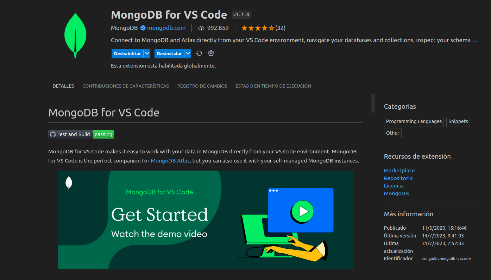

## Mongo DB  

Cuando hablamos de bases de datos tendemos a pensar en SQL y el modelo de bases de datos relacional, pero existen alternativas como los modelos no relacionales donde MongoDB es quizá el ejemplo más destacado.

MongoDB (del inglés humongous, "enorme") es un sistema de base de datos NoSQL orientado a documentos de código abierto y escrito en C++, que en lugar de guardar los datos en tablas lo hace en estructuras de datos BSON (similar a JSON) con un esquema dinámico. Al ser un proyecto de código abierto, sus binarios están disponibles para los sistemas operativos Windows, GNU/Linux, OS X y Solaris y es usado en múltiples proyectos o implementaciones en empresas como MTV Network, Craigslist, BCI o Foursquare.

## Inicialización del proyecto. 

- Clonamos el proyecto en un directorio. 
- Entramos al directorio clonado

```bash
> git clone https://github.com/TheHackBoxCampus/mongoDB_practice.git
> cd mongodb_practice 
```

## Conexión con MongoDB Atlas | Conexion desde la nube 

Para que podamos ejecutar el script ``'query.mongodb'`` tenemos que conectarnos con ``mongo``, existen varias formas de utilizar mongo
te puedes conectar al loopback o directamente al cloud con mongo db ``ATLAS``

En esta ocasión se estara utilizando ``mongodb atlas`` para registrar los documentos en la nube.

Requerimientos:

- Tener una cuenta de mongoDB ``atlas`` 
- ! si no tienes una cuenta puedes consultar este video y realizar el proceso: https://youtu.be/hXyIv_vKdUs
- Tener autenticacion para conectarse con ``atlas``, es decir consultar un enlace como el siguiente: 

```txt
> mongodb+srv://<user>:<password>@cluster0.lfwybpj.mongodb.net/
``` 
- Una vez ya consultado puede conectarte con ``mongoDB compass`` o con la extension de **visual studio code** -> ``mongoDB`` 
 
### Mongo DB Compass


### Mongo DB Extension de VSCODE 



- Cualquiera de las 2 opciones son validas, depende de gusto y comodidad

### Funcionamiento del proyecto.

Dentro del directorio padre ``mongodb_practice`` encontraremos un archivo ``query.mongodb``  en la ruta principal (``/``).

Donde estaran las consultas para crear el siguiente modelo relacional


Tablas: 

- sucursal
- sucursal automovil
- reserva
- automovil
- cliente
- alquiler
- registro devolucion
- registro entrega
- empleado


### Consultas 

- Mostrar todos los clientes registrados en la base de datos.
- Obtener todos los automóviles disponibles para alquiler
- Listar todos los alquileres activos junto con los datos de los clientes relacionados
- Mostrar todas las reservas pendientes con los datos del cliente y el automóvil reservado.
- Obtener los detalles del alquiler con el ID_Alquiler específico.
- Listar los empleados con el cargo Vendedor
- Mostrar la cantidad total de automóviles "disponibles" en cada sucursal.
- Obtener el costo total de un alquiler específico.
- Listar los clientes con el DNI específico.
- Mostrar todos los automóviles con una capacidad mayor a 5 personas.
- Obtener los detalles del alquiler que tiene fecha de inicio en 2023-07-05.
- Listar las reservas pendientes realizadas por un cliente
   específico.
- Mostrar los empleados con cargo de "Gerente" o "Asistente".
- Obtener los datos de los clientes que realizaron al menos un alquiler.
- Listar todos los automóviles ordenados por marca y modelo.
- Mostrar la cantidad total de automóviles en cada sucursal junto con su dirección.
- Obtener la cantidad total de alquileres registrados en la base de datos.
- Mostrar los automóviles con capacidad igual a 5 personas y que estén disponibles.
- Listar los alquileres con fecha de inicio entre '2023-07-05' y '2023-07-10'.


## Informacion de las consultas 

Consulta el sitio web: https://medium.com/@diego.coder/relaciones-en-mongodb-edf2107a94ad

Para que entiendas como se hicieron las consultas.

## Contacto 

Nombre: **MILLER KALED NARIÑO IBARRA**

email: **kalednarino@gmail.com** 